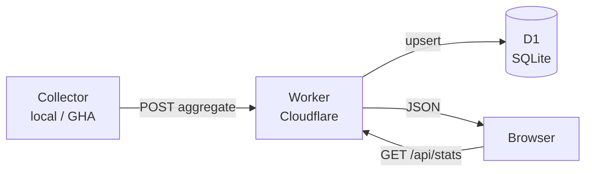
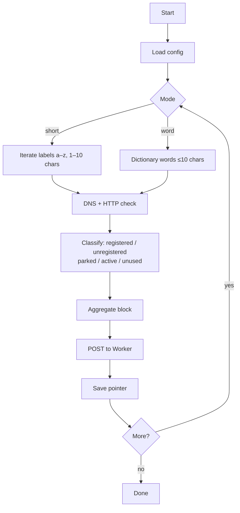

# dom4in.net

**Live site → [dom4in.net](https://dom4in.net)**

A domain market statistics dashboard. Samples short domains (1–10 character labels) across major TLDs and displays aggregated data — registered vs. available, parked vs. active — similar to a stock market overview. No per-domain lists are ever stored or published.


---

## How it's built

```
dom4in.net/
├── frontend/     Static HTML/CSS/JS — Cloudflare Pages
├── backend/      Cloudflare Worker + D1 — REST API
└── collector/    Python — runs locally or via GitHub Actions
```

**Frontend** (`frontend/index.html`) — single-file static site. Fetches aggregated stats from the Worker and renders KPI cards, a length-breakdown table, and per-category charts.

**Backend** (`backend/src/index.js`) — Cloudflare Worker backed by D1 (SQLite). Public read endpoints for stats; admin endpoints (key-protected) for the collector to push aggregates and track run state.

**Collector** (`collector/collector.py`) — Python script that probes domains via DNS-over-HTTPS + HTTP, classifies each one, and uploads only the aggregated counts. Restart-safe via pointer files. Runs on a schedule in GitHub Actions (3×/day) using cloud-persisted state so runs are stateless.

### Data flow



### Collector flow



---

## Tech stack

| Layer | Technology |
|---|---|
| Frontend hosting | Cloudflare Pages |
| API | Cloudflare Workers (JS, no framework) |
| Database | Cloudflare D1 (SQLite at the edge) |
| Collector | Python 3.11, `httpx`, DNS-over-HTTPS |
| CI/CD | GitHub Actions (deploy + scheduled collector) |
| DNS probing | Cloudflare & Google DoH endpoints |

---

## Setup

### Prerequisites
- Cloudflare account with Workers and D1 enabled
- [Wrangler CLI](https://developers.cloudflare.com/workers/wrangler/) v4+
- Python 3.11+

### 1. Clone & configure

```bash
git clone https://github.com/your-handle/dom4in.net
cd dom4in.net
```

Create `collector/config.local.json` (gitignored):

```json
{
  "api_base": "https://dom4in.net",
  "admin_api_key": "YOUR_ADMIN_API_KEY"
}
```

Create `backend/.dev.vars` (gitignored):

```
ADMIN_API_KEY=YOUR_ADMIN_API_KEY
```

### 2. Create D1 database

```bash
wrangler d1 create DOM4IN_DB
# Copy the database_id into backend/wrangler.toml
wrangler d1 execute DOM4IN_DB --remote --file=backend/db/schema.sql
```

### 3. Deploy the Worker

```bash
cd backend && wrangler deploy
```

Set `ADMIN_API_KEY` as a secret on the Worker in the Cloudflare dashboard.

### 4. Deploy the frontend

Connect the repo to Cloudflare Pages:
- Build command: *(none)*
- Output directory: `frontend`

### 5. Run the collector

```bash
# One-time: generate word dictionary
python collector/load_dictionary.py

# Continuous mixed run (short + word modes)
python collector/collector.py --short --word --pause 60

# GitHub Actions: scheduled automatically via .github/workflows/collector.yml
```

### Collector options

| Flag | Description |
|---|---|
| `--short` | Sample short labels (a–z, 1–10 chars) |
| `--word` | Sample real English words ≤10 chars |
| `--pause N` | Sleep N seconds between blocks |
| `--dry-run` | Print payload without uploading |
| `--reset-pointer` | Clear short-mode progress |
| `--reset-db` | Wipe D1 aggregates (requires admin key) |

---

## GitHub Actions

| Workflow | Trigger | What it does |
|---|---|---|
| `deploy-worker.yml` | Push to `main` (backend changes) | Deploys Worker via Wrangler |
| `collector.yml` | Cron 06:00/14:00/22:00 UTC + manual | Runs short-mode collector for 40 min |

Required secrets: `CLOUDFLARE_API_TOKEN`, `CLOUDFLARE_ACCOUNT_ID`, `ADMIN_API_KEY`.

---

## API

| Endpoint | Auth | Description |
|---|---|---|
| `GET /api/health` | — | DB-backed health check (returns 200 healthy / 503 degraded). Not cached, not rate-limited. |
| `GET /api/stats/overview` | — | Aggregated stats + run freshness. Edge-cached 5 min, per-IP rate-limited. |
| `GET /api/stats/words` | — | Word/POS breakdown. Edge-cached 5 min, per-IP rate-limited. |
| `POST /api/admin/upload-aggregate` | Admin key | Collector pushes a block |
| `POST /api/admin/reset-stats` | Admin key | Wipe all aggregates |
| `GET/PUT /api/admin/state` | Admin key | Cloud pointer storage |
| `POST /api/admin/runs` | Admin key | Run lifecycle events |

### Abuse protection

Public read endpoints are protected by two layers configured in `backend/wrangler.toml` and `backend/src/index.js`:

- **Edge caching:** `Cache-Control: public, max-age=60, s-maxage=300, stale-while-revalidate=600`. Cloudflare's edge serves the same JSON to repeat callers for ~5 minutes without invoking the Worker or D1, so a scraper hammering the URL gets static JSON for free.
- **Per-IP rate limit:** 60 requests/min/IP via the `RATE_LIMITER` Worker binding. Excess returns `429` with `Retry-After: 60`. The watchdog hits `/api/health` (which is never rate-limited) so monitoring is never throttled.

Error responses (`5xx`, `429`) carry `Cache-Control: no-store` so transient failures aren't cached at the edge.

---

## Design principles

- **Aggregates only on public endpoints** — every `/api/stats/*` response returns counts and rates, never per-domain lists. Per-domain detail exists for paid products but only ever leaves the system via signed export URLs.
- **Walk-away safe** — no servers to maintain; everything runs on Cloudflare's free/low-cost tier and GitHub Actions.
- **Restart-safe collectors** — pointer files (local) or D1 state (cloud); CZDS ingest is idempotent on `(snap_date, tld)`; ICANN report ingest is idempotent on `(report_month, iana_id, tld)`.
- **Idempotent uploads** — `(run_id, batch_id)` dedup prevents double-counting if GHA retries a step.

---

## v3 — Company infrastructure tracker (current direction, 2026-05-19)

The site is pivoting from brand-watch products (dropped) to a **public DNS / infrastructure data product** with these deliverables:

1. **Free monthly newsletter** — 3–5 charts + one "story of the month" on provider share movement.
2. **Free data feed** — CSV/JSON at stable URLs, no auth. Anyone can `curl` it weekly.
3. **Paid quarterly PDF + full CSV** — per-vertical, per-company commentary (built after ~3 months of data exist).

**Corpus (free, public sources):**

| Set | Size | Source |
|---|---|---|
| S&P 500 | 500 | Wikipedia (`List_of_S%26P_500_companies`) |
| Russell 1000 | 1,000 | Wikipedia (`Russell_1000_Index`) |
| All US public (Russell 3000 / SEC EDGAR) | ~6,000 | SEC EDGAR `company_tickers.json` |
| Tranco Top 10,000 | 10,000 | tranco-list.eu (free academic) |

All probed **monthly**. Stratified outputs ("Cloudflare = 18% of S&P 500, 31% of Tranco Top 100") published per tier.

**Per-domain monthly probe (zero or low risk, all free):**
- DNS: NS, MX, A/AAAA, TXT, DNSSEC, CAA records
- IP → ASN → cloud provider (AWS / Azure / GCP / Cloudflare / Akamai / Fastly / etc.)
- TXT-record SaaS detection (`google-site-verification`, `atlassian-domain-verification`, etc.)
- Cert issuer (from CT logs)
- Home-page HTML fetch with GA / GTM / framework detection — home page only, honor robots.txt, rate-limited

**Aggregations published monthly:**
- NS provider share (per tier)
- Mail provider share (per tier)
- Cloud / hosting provider share
- CDN provider share
- Analytics + marketing-stack share
- DNSSEC adoption
- TLD / registrar trends (sidebar, from existing collector)

### v3 schema additions

- `companies` — corpus, with `in_sp500` / `in_russell1000` / `in_russell3000` / `in_us_public` flags
- `tranco_ranks` — per-(domain, month) rank, drives the top-sites tiers
- `monthly_probe` — one row per (domain, month) with all detected providers
- `provider_dim` — provider key → category + display name
- `provider_share_monthly` — pre-computed rollups the public site reads directly

### v3 admin endpoints

All accept `{rows: [...]}`. Idempotent via `ON CONFLICT DO UPDATE`.

- `POST /api/admin/companies` — upsert corpus rows
- `POST /api/admin/tranco-ranks` — upsert Tranco ranks
- `POST /api/admin/monthly-probe` — upsert per-domain monthly probe rows
- `POST /api/admin/provider-dim` — upsert provider dimension
- `POST /api/admin/provider-share` — upsert rollups

### v3 public endpoints

- `GET /api/stats/providers` — latest month's provider shares (params: `tier`, `category`)
- `GET /api/stats/providers/history?tier=sp500&category=ns&months=12` — historical share for line charts

### v3 manual setup

1. **Apply schema migration**: `cd backend && wrangler d1 execute DOM4IN_DB --remote --file=./db/schema.sql`
2. **Deploy Worker**: `cd backend && wrangler deploy`
3. **Seed company corpus**: `python collector/seed/company_corpus.py` — populates `companies` and `tranco_ranks`
4. **Add manual overrides** as needed in `collector/seed/manual_domain_overrides.json` (CIK/ticker → canonical domain) for cases where `{ticker}.com` is wrong. Re-run the seeder to update.

### v3 deferred (next sessions)

- Monthly probe script (`collector/monthly_probe.py`) and its GHA workflow
- Provider detection rules (NS / MX / ASN / TXT / HTML patterns)
- Rollup computation script
- Multi-page frontend with menus + ECharts (Home / Public Companies / Top Websites / Domain Stats / Data / Newsletter / Methodology)
- Newsletter (likely Buttondown or static markdown + RSS)

### Domain-stats sidebar (kept from earlier build)

The TLD-level trend tables still ingest in parallel and feed the "Domain Stats" section of the site:

- `tld_dim` — TLD metadata (IANA + classification)
- `registrar_dim` — ICANN-accredited registrars
- `registrar_monthly_stats` — ICANN monthly transaction reports (per registrar × TLD)
- `zone_diff_daily` — daily aggregate counts from the probe collector

Workflows that feed it: `collector.yml`, `icann-reports.yml`.

Their admin endpoints (`/api/admin/tld-dim`, `/api/admin/registrar-dim`, `/api/admin/registrar-monthly`, `/api/admin/zone-diff`) are unchanged.

---

## Manual setup checklist (v3)

Everything runs in GitHub Actions. No local wrangler needed.

1. Actions → **`[setup] DB Migration`** → Run workflow (applies `schema.sql`)
2. Push any `backend/**` change to `main` — **`[auto] Deploy Worker`** picks it up automatically
3. Actions → **`[auto] Corpus Seed`** → Run workflow (seeds `companies` + `tranco_ranks`)
4. Actions → **`[oneshot] Cleanup v3`** → Run workflow (drops deprecated tables, removes CZDS tombstones). After it goes green, `git rm .github/workflows/cleanup-v3.yml backend/db/migrations/001_drop_brand_tables.sql` and commit.

### Workflow naming convention

Every workflow's `name:` is prefixed with a tag so the Actions sidebar groups cleanly:

- **`[setup]`** — sets up infrastructure (DB migrations, blob buckets, etc.). Manual-trigger.
- **`[auto]`** — runs on a cron or push trigger continuously (collectors, deploys, watchdogs).
- **`[oneshot]`** — single-use cleanup or migration. After a successful run the workflow file gets `git rm`'d in the next commit.

When adding a new workflow, pick a tag and put it in single quotes in the YAML: `name: '[auto] My New Thing'`.

### v3 workflows

| Workflow | Tag | Trigger | What it does |
|---|---|---|---|
| `collector.yml` | auto | Cron 06/14/22 UTC + manual | Probe-based aggregate collector (TLD trends) |
| `icann-reports.yml` | auto | Cron 11:23 UTC on the 5th | Pulls ICANN monthly registrar reports |
| `corpus-seed.yml` | auto | Cron 06:00 UTC on the 2nd + manual | Refreshes companies + Tranco ranks |
| `deploy-worker.yml` | auto | Push to `main` (backend changes) | Deploys Worker via Wrangler |
| `watchdog.yml` | auto | Scheduled | Health checks against `/api/health` |
| `setup-db.yml` | setup | Manual | Applies `schema.sql` and optional migration files |
| `cleanup-v3.yml` | oneshot | Manual | Drops deprecated brand tables, removes CZDS tombstones. Delete the file after a successful run. |

Next session ships the monthly probe script + GHA workflow + the multi-page ECharts frontend.

---

## License

MIT
