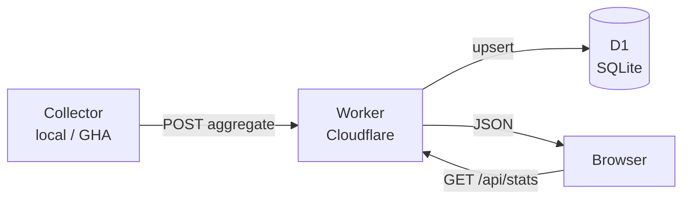
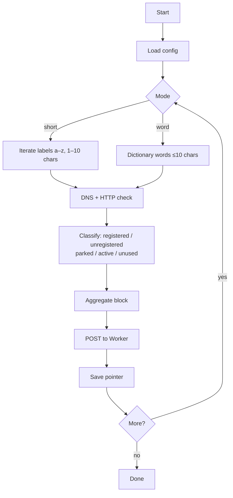

# dom4in.net

**Live site → [dom4in.net](https://dom4in.net)**

A domain market statistics dashboard. Samples short domains (1–10 character labels) across major TLDs and displays aggregated data — registered vs. available, parked vs. active — similar to a stock market overview. No per-domain lists are ever stored or published.


---

## How it's built

```
dom4in.net/
├── frontend/     Static HTML/CSS/JS — Cloudflare Pages
├── backend/      Cloudflare Worker + D1 — REST API
└── collector/    Python — runs locally or via GitHub Actions
```

**Frontend** (`frontend/index.html`) — single-file static site. Fetches aggregated stats from the Worker and renders KPI cards, a length-breakdown table, and per-category charts.

**Backend** (`backend/src/index.js`) — Cloudflare Worker backed by D1 (SQLite). Public read endpoints for stats; admin endpoints (key-protected) for the collector to push aggregates and track run state.

**Collector** (`collector/collector.py`) — Python script that probes domains via DNS-over-HTTPS + HTTP, classifies each one, and uploads only the aggregated counts. Restart-safe via pointer files. Runs on a schedule in GitHub Actions (3×/day) using cloud-persisted state so runs are stateless.

### Data flow



### Collector flow



---

## Tech stack

| Layer | Technology |
|---|---|
| Frontend hosting | Cloudflare Pages |
| API | Cloudflare Workers (JS, no framework) |
| Database | Cloudflare D1 (SQLite at the edge) |
| Collector | Python 3.11, `httpx`, DNS-over-HTTPS |
| CI/CD | GitHub Actions (deploy + scheduled collector) |
| DNS probing | Cloudflare & Google DoH endpoints |

---

## Setup

### Prerequisites
- Cloudflare account with Workers and D1 enabled
- [Wrangler CLI](https://developers.cloudflare.com/workers/wrangler/) v4+
- Python 3.11+

### 1. Clone & configure

```bash
git clone https://github.com/your-handle/dom4in.net
cd dom4in.net
```

Create `collector/config.local.json` (gitignored):

```json
{
  "api_base": "https://dom4in.net",
  "admin_api_key": "YOUR_ADMIN_API_KEY"
}
```

Create `backend/.dev.vars` (gitignored):

```
ADMIN_API_KEY=YOUR_ADMIN_API_KEY
```

### 2. Create D1 database

```bash
wrangler d1 create DOM4IN_DB
# Copy the database_id into backend/wrangler.toml
wrangler d1 execute DOM4IN_DB --remote --file=backend/db/schema.sql
```

### 3. Deploy the Worker

```bash
cd backend && wrangler deploy
```

Set `ADMIN_API_KEY` as a secret on the Worker in the Cloudflare dashboard.

### 4. Deploy the frontend

Connect the repo to Cloudflare Pages:
- Build command: *(none)*
- Output directory: `frontend`

### 5. Run the collector

```bash
# One-time: generate word dictionary
python collector/load_dictionary.py

# Continuous mixed run (short + word modes)
python collector/collector.py --short --word --pause 60

# GitHub Actions: scheduled automatically via .github/workflows/collector.yml
```

### Collector options

| Flag | Description |
|---|---|
| `--short` | Sample short labels (a–z, 1–10 chars) |
| `--word` | Sample real English words ≤10 chars |
| `--pause N` | Sleep N seconds between blocks |
| `--dry-run` | Print payload without uploading |
| `--reset-pointer` | Clear short-mode progress |
| `--reset-db` | Wipe D1 aggregates (requires admin key) |

---

## GitHub Actions

| Workflow | Trigger | What it does |
|---|---|---|
| `deploy-worker.yml` | Push to `main` (backend changes) | Deploys Worker via Wrangler |
| `collector.yml` | Cron 06:00/14:00/22:00 UTC + manual | Runs short-mode collector for 40 min |

Required secrets: `CLOUDFLARE_API_TOKEN`, `CLOUDFLARE_ACCOUNT_ID`, `ADMIN_API_KEY`.

---

## API

| Endpoint | Auth | Description |
|---|---|---|
| `GET /api/health` | — | Status check |
| `GET /api/stats/overview` | — | Aggregated stats + run freshness |
| `GET /api/stats/words` | — | Word/POS breakdown |
| `POST /api/admin/upload-aggregate` | Admin key | Collector pushes a block |
| `POST /api/admin/reset-stats` | Admin key | Wipe all aggregates |
| `GET/PUT /api/admin/state` | Admin key | Cloud pointer storage |
| `POST /api/admin/runs` | Admin key | Run lifecycle events |

---

## Design principles

- **Aggregates only** — raw domain names are never stored remotely.
- **Walk-away safe** — no servers to maintain; everything runs on Cloudflare's free/low-cost tier and GitHub Actions.
- **Restart-safe collector** — pointer files (local) or D1 state (cloud) mean a crashed run picks up where it left off.
- **Idempotent uploads** — `(run_id, batch_id)` dedup prevents double-counting if GHA retries a step.

---

## License

MIT
