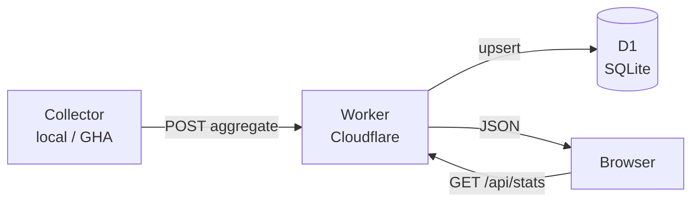
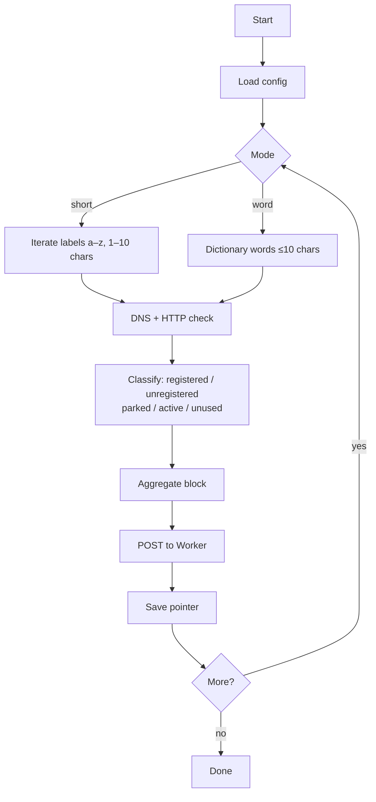

# dom4in.net

**Live site → [dom4in.net](https://dom4in.net)**

A domain market statistics dashboard. Samples short domains (1–10 character labels) across major TLDs and displays aggregated data — registered vs. available, parked vs. active — similar to a stock market overview. No per-domain lists are ever stored or published.


---

## How it's built

```
dom4in.net/
├── frontend/     Static HTML/CSS/JS — Cloudflare Pages
├── backend/      Cloudflare Worker + D1 — REST API
└── collector/    Python — runs locally or via GitHub Actions
```

**Frontend** (`frontend/index.html`) — single-file static site. Fetches aggregated stats from the Worker and renders KPI cards, a length-breakdown table, and per-category charts.

**Backend** (`backend/src/index.js`) — Cloudflare Worker backed by D1 (SQLite). Public read endpoints for stats; admin endpoints (key-protected) for the collector to push aggregates and track run state.

**Collector** (`collector/collector.py`) — Python script that probes domains via DNS-over-HTTPS + HTTP, classifies each one, and uploads only the aggregated counts. Restart-safe via pointer files. Runs on a schedule in GitHub Actions (3×/day) using cloud-persisted state so runs are stateless.

### Data flow



### Collector flow



---

## Tech stack

| Layer | Technology |
|---|---|
| Frontend hosting | Cloudflare Pages |
| API | Cloudflare Workers (JS, no framework) |
| Database | Cloudflare D1 (SQLite at the edge) |
| Collector | Python 3.11, `httpx`, DNS-over-HTTPS |
| CI/CD | GitHub Actions (deploy + scheduled collector) |
| DNS probing | Cloudflare & Google DoH endpoints |

---

## Setup

### Prerequisites
- Cloudflare account with Workers and D1 enabled
- [Wrangler CLI](https://developers.cloudflare.com/workers/wrangler/) v4+
- Python 3.11+

### 1. Clone & configure

```bash
git clone https://github.com/your-handle/dom4in.net
cd dom4in.net
```

Create `collector/config.local.json` (gitignored):

```json
{
  "api_base": "https://dom4in.net",
  "admin_api_key": "YOUR_ADMIN_API_KEY"
}
```

Create `backend/.dev.vars` (gitignored):

```
ADMIN_API_KEY=YOUR_ADMIN_API_KEY
```

### 2. Create D1 database

```bash
wrangler d1 create DOM4IN_DB
# Copy the database_id into backend/wrangler.toml
wrangler d1 execute DOM4IN_DB --remote --file=backend/db/schema.sql
```

### 3. Deploy the Worker

```bash
cd backend && wrangler deploy
```

Set `ADMIN_API_KEY` as a secret on the Worker in the Cloudflare dashboard.

### 4. Deploy the frontend

Connect the repo to Cloudflare Pages:
- Build command: *(none)*
- Output directory: `frontend`

### 5. Run the collector

```bash
# One-time: generate word dictionary
python collector/load_dictionary.py

# Continuous mixed run (short + word modes)
python collector/collector.py --short --word --pause 60

# GitHub Actions: scheduled automatically via .github/workflows/collector.yml
```

### Collector options

| Flag | Description |
|---|---|
| `--short` | Sample short labels (a–z, 1–10 chars) |
| `--word` | Sample real English words ≤10 chars |
| `--pause N` | Sleep N seconds between blocks |
| `--dry-run` | Print payload without uploading |
| `--reset-pointer` | Clear short-mode progress |
| `--reset-db` | Wipe D1 aggregates (requires admin key) |

---

## GitHub Actions

| Workflow | Trigger | What it does |
|---|---|---|
| `deploy-worker.yml` | Push to `main` (backend changes) | Deploys Worker via Wrangler |
| `collector.yml` | Cron 06:00/14:00/22:00 UTC + manual | Runs short-mode collector for 40 min |

Required secrets: `CLOUDFLARE_API_TOKEN`, `CLOUDFLARE_ACCOUNT_ID`, `ADMIN_API_KEY`.

---

## API

| Endpoint | Auth | Description |
|---|---|---|
| `GET /api/health` | — | DB-backed health check (returns 200 healthy / 503 degraded). Not cached, not rate-limited. |
| `GET /api/stats/overview` | — | Aggregated stats + run freshness. Edge-cached 5 min, per-IP rate-limited. |
| `GET /api/stats/words` | — | Word/POS breakdown. Edge-cached 5 min, per-IP rate-limited. |
| `POST /api/admin/upload-aggregate` | Admin key | Collector pushes a block |
| `POST /api/admin/reset-stats` | Admin key | Wipe all aggregates |
| `GET/PUT /api/admin/state` | Admin key | Cloud pointer storage |
| `POST /api/admin/runs` | Admin key | Run lifecycle events |

### Abuse protection

Public read endpoints are protected by two layers configured in `backend/wrangler.toml` and `backend/src/index.js`:

- **Edge caching:** `Cache-Control: public, max-age=60, s-maxage=300, stale-while-revalidate=600`. Cloudflare's edge serves the same JSON to repeat callers for ~5 minutes without invoking the Worker or D1, so a scraper hammering the URL gets static JSON for free.
- **Per-IP rate limit:** 60 requests/min/IP via the `RATE_LIMITER` Worker binding. Excess returns `429` with `Retry-After: 60`. The watchdog hits `/api/health` (which is never rate-limited) so monitoring is never throttled.

Error responses (`5xx`, `429`) carry `Cache-Control: no-store` so transient failures aren't cached at the edge.

---

## Design principles

- **Aggregates only on public endpoints** — every `/api/stats/*` response returns counts and rates, never per-domain lists. Per-domain detail exists for paid products but only ever leaves the system via signed export URLs.
- **Walk-away safe** — no servers to maintain; everything runs on Cloudflare's free/low-cost tier and GitHub Actions.
- **Restart-safe collectors** — pointer files (local) or D1 state (cloud); CZDS ingest is idempotent on `(snap_date, tld)`; ICANN report ingest is idempotent on `(report_month, iana_id, tld)`.
- **Idempotent uploads** — `(run_id, batch_id)` dedup prevents double-counting if GHA retries a step.

---

## v2 — Ground-truth observatory (in progress)

The site is expanding from "probe-sampled aggregates" to a full ground-truth observatory of the global domain market, built on three free authoritative sources:

| Source | What it gives us | Cadence |
|---|---|---|
| **ICANN CZDS** zone files | Every registered second-level label across ~1,200 gTLDs | Daily |
| **ICANN monthly registrar reports** | Per-registrar transaction counts and domains-under-management per TLD | Monthly |
| **RDAP** (IANA bootstrap) | Sponsoring registrar attribution per domain | Sampled, on-demand |

This unlocks four product directions (all under one brand, shared infra):

1. **Domain Atlas** — free public dashboard of registration/drop trends, registrar share, new-gTLD adoption curves, pronounceable-availability index. Pure SEO/credibility play.
2. **TLD Launch Reports** — free PDF on each new gTLD General Availability event (top-line stats + brand registrations). Linkbait that earns SEO.
3. **Registrar Intelligence** — quarterly free Trust Index ranking + paid detailed PDF + CSV exports for procurement/competitive intel buyers.
4. **Brand Sentinel** — paid one-time purchase. Customer's trademark list is watched across all CZDS zones; new-registration matches are emailed. Sellable variant: anyone can buy past brand-watch reports for marquee brands.

### v2 data model (additions to `backend/db/schema.sql`)

- `tld_dim` — every TLD with type/registry/jurisdiction/CZDS-coverage flag
- `registrar_dim` — ICANN-accredited registrars (one row per IANA ID)
- `registrar_monthly_stats` — ICANN-published per-(registrar, TLD, month) counts
- `zone_diff_daily` — aggregate-only daily new/dropped counts per TLD from CZDS
- `registrar_tld_coverage` — registrar × TLD pricing matrix (populated by future scrape)
- `brand_watchlist` + `brand_match_event` — Sentinel patterns and hits

Per-domain CZDS snapshots live in **R2** (private bucket, never public).

### v2 workflows

| Workflow | Trigger | What it does |
|---|---|---|
| `collector.yml` | Cron 06/14/22 UTC + manual | Existing probe-based aggregate collector |
| `czds.yml` | Cron 05:17 UTC daily | Pulls CZDS zone files, diffs vs yesterday, posts aggregates + brand matches |
| `icann-reports.yml` | Cron 11:23 UTC on the 5th | Pulls ICANN's monthly registrar reports (2-month lag) |
| `deploy-worker.yml` | Push to `main` | Deploys Worker via Wrangler |
| `watchdog.yml` | Scheduled | Health checks against `/api/health` |

### v2 admin endpoints

Each accepts `{rows: [...]}` and is idempotent (ON CONFLICT DO UPDATE).

- `POST /api/admin/tld-dim` — upsert TLD dimension entries (used by `collector/seed/tld_seed.py`)
- `POST /api/admin/registrar-dim` — upsert registrar entries
- `POST /api/admin/registrar-monthly` — upsert ICANN monthly reports
- `POST /api/admin/zone-diff` — upsert daily CZDS aggregates
- `POST /api/admin/brand-match` — insert brand-pattern hits (dedupe via unique index)
- `POST /api/admin/watchlist` — add watchlist patterns
- `GET  /api/admin/watchlist` — list active patterns

Public additions:
- `GET /api/stats/brand-matches` — 30-day count + top TLDs by match volume. **Counts only**; matched domains are never returned.

---

## Manual setup checklist (you do these; everything else is automated)

These are the steps that require either signing into a third party, completing legal/business paperwork, or pasting a secret. Do them in this order; nothing later breaks if earlier steps are deferred — the workflows guard for missing credentials.

### 1. Apply for ICANN CZDS access (~2 week wait)

This unlocks daily zone-file diffs for all gTLDs, which is the foundation for v2. The application is free but you sign per-TLD agreements.

1. Create an account at **https://czds.icann.org/** (use a business-sounding email — registries scrutinize signups).
2. Add your contact details. Use phrasing like: *"Aggregate research on domain registration trends; outputs are statistical aggregates and brand-protection alerts. Per-domain detail is retained privately, never republished."*
3. Submit a bulk-approval request: in the dashboard, **Add Multiple Zones**, paste a TLD list (start with the top ~50: `com net org io co info biz online store app dev ai xyz me uk us tv cc ...`). Most registries auto-approve; a few require a click.
4. Once approved, generate API credentials in the portal and save them as repo secrets:
   - `CZDS_USERNAME` — your CZDS portal email
   - `CZDS_PASSWORD` — your CZDS portal password

The `czds.yml` workflow exits cleanly until both are present, so adding them later is the only thing needed to turn ingestion on.

### 2. Create a Cloudflare R2 bucket for zone snapshots

CZDS snapshots are too large to fit in D1 and contain per-domain data we don't want anywhere public.

1. In the Cloudflare dashboard → **R2 → Create bucket**. Name it `dom4in-zones` (or anything; you'll wire the name in step 3).
2. **Enable Object Versioning** on the bucket (Bucket → Settings) so historical snapshots are retained for backfill/audit.
3. **R2 → Manage R2 API Tokens → Create API Token** with read/write to that single bucket. Save:
   - `R2_ACCOUNT_ID` (your CF account ID, also visible in the URL)
   - `R2_ACCESS_KEY_ID`
   - `R2_SECRET_ACCESS_KEY`
   - `R2_BUCKET` (the bucket name)

Without these the CZDS pipeline still runs but uses `/tmp` for yesterday's snapshot, meaning every domain looks "new" each run. Configure R2 before relying on diffs.

### 3. Add the new repo secrets

In **GitHub → Settings → Secrets and variables → Actions**, add (alongside the existing `ADMIN_API_KEY`, `CLOUDFLARE_API_TOKEN`, `CLOUDFLARE_ACCOUNT_ID`):

- `CZDS_USERNAME`
- `CZDS_PASSWORD`
- `R2_ACCOUNT_ID`
- `R2_ACCESS_KEY_ID`
- `R2_SECRET_ACCESS_KEY`
- `R2_BUCKET`

### 4. Apply the v2 schema migration

```bash
cd backend
wrangler d1 execute DOM4IN_DB --remote --file=./db/schema.sql
```

The schema file uses `CREATE TABLE IF NOT EXISTS` and `CREATE INDEX IF NOT EXISTS` throughout, so re-applying it is safe.

### 5. Deploy the updated Worker

```bash
cd backend && wrangler deploy
```

This activates the new admin endpoints. Existing public endpoints are unchanged.

### 6. Seed the TLD dimension table

After the Worker is deployed:

```bash
python collector/seed/tld_seed.py
```

This pulls IANA's authoritative TLD list + CZDS's coverage list and populates `tld_dim`. Re-run any time to refresh.

### 7. Manually trigger the first ingest runs (smoke test)

In GitHub Actions:

- Run **ICANN Registrar Reports** workflow manually first (no credentials needed beyond `ADMIN_API_KEY`) — this validates the schema and Worker without depending on CZDS.
- Once CZDS credentials are saved, run **CZDS Ingest** manually. The first run is the slowest; subsequent diffs are quick.

### 8. (Later, when ready to monetize) Stripe + delivery wiring

Not in this batch — added in a follow-up. The hooks needed are:

- Stripe Payment Link per product (PDF report, Brand Sentinel watchlist seat, CSV export).
- One Worker route `POST /api/stripe/webhook` that verifies signatures and writes purchase records to a new `purchases` table.
- For Brand Sentinel: on purchase, create one `brand_watchlist` row per pattern with `owner_email = customer.email` and `expires_at = +24 months`.
- For one-shot exports: generate a signed R2 URL valid for 7 days and email it via Resend/MailChannels.

No login portal is needed for the download products. A login is only needed for Brand Sentinel customers to manage their watchlist — recommend the tiny OIDC-Worker pattern on `id.dom4in.net` when that day comes.

---

## License

MIT
